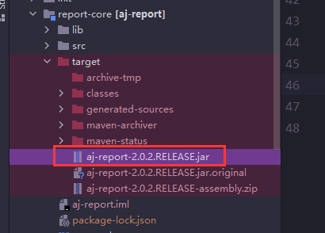
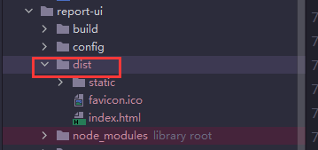

**前后端分离：** <br>
**请对自己有动手能力的小伙伴进行尝试** <br>
**请根据自己的实际情况对下面的步骤和内容进行调整** <br>

```
linux：
git clone https://gitee.com/anji-plus/report.git
后端：report-code ：
修改bootstrap.yml
maven package
java -jar

前端：report-ui ：
修改前端config连接
BASE_API: '"./"'，改成自己后端的api
npm install
npm run build
```

## linux部署后端

### 编译环境

- [Apache Maven] 3.5 <br>
- [Node.js] v14.16.0 <br>
- [Jdk] 1.8 <br>
  请在你的Windows上先准备好maven、node.js、jdk <br>
  **注**：已知 **Jdk11** (部分小版本)存在兼容性问题，请不要使用openJdk，环境问题请看 **常见问题** 大类 <br>

### 克隆源码

git clone https://gitee.com/anji-plus/report.git <br>
 <br>
**注**：不要下载发行版里面的 Source Code.zip <br>

### 修改mysql连接

report-core --> src --> main --> resources --> bootstrap.yml <br>
 <br>
将图中关于mysql的连接配置信息换成你使用的IP <br>
**注**：aj_report库是存放底层基础信息的库，flyway启动时会自动建立，如果你在这里修改了库，将会出错<br>
**注**：请确认你的Mysql是否支持远程连接，登陆用户是否有DDL权限 <br>

### 上传功能

使用上传功能，必须修改此内容，注意路径格式，比如Win是 \ ,linux是 / <br>
 <br>

### maven打包

**打包之前如果系统用的不止mysql数据源，需要自己在pom文件中加入对应的数据库的驱动，登陆系统之后，数据源提示无驱动，则选择通用JDBC数据源，这里不做演示了** <br>
使用 maven package <br>
**注**：不要使用maven install <br>
 <br>

### linux启动jar包

将上步生成的jar包上传至linux，使用java -jar命令启动 <br>
**注**：请确保你的linux有jdk <br>

## 本地启动前端

### 前端编译

进入前端目录：report-ui <br>
 <br>
执行 npm install <br>

### 修改config

目录地址：report-ui --> config --> dev.env.js <br>
修改你的BASE_API地址 <br>

### 启动前端

report-ui目录： <br>
执行 npm run dev <br>

## 前端build

### 前端编译

进入前端目录：report-ui <br>
 <br>
执行 npm install <br>

### 修改config

目录地址：report-ui --> config --> prod.env.js <br>
修改你的BASE_API地址，改成自己后端的api <br>

### build

reoprt-ui目录： <br>
执行 npm run build <br>

生成的前端dist目录文件在report-ui下面 <br>
 <br>


